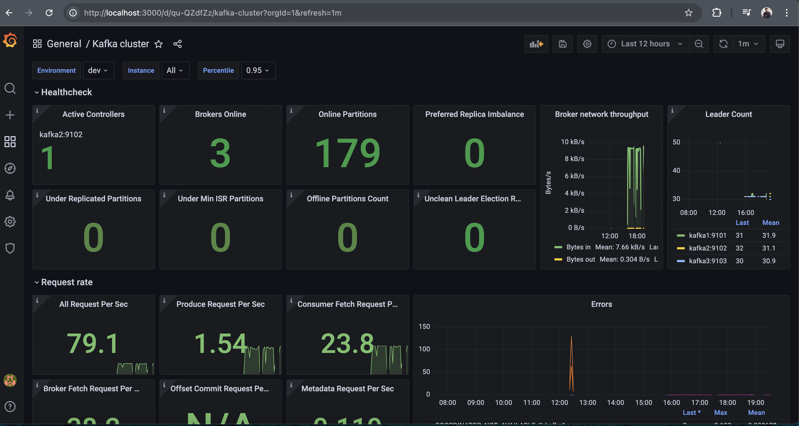
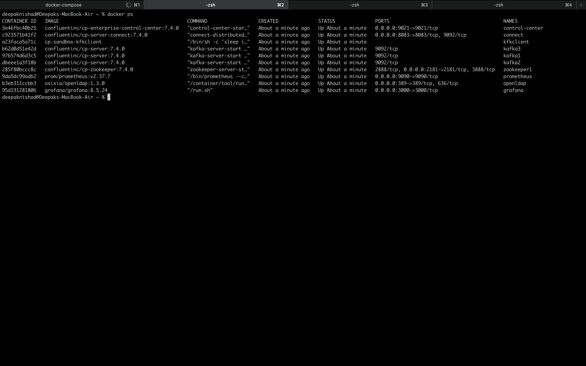
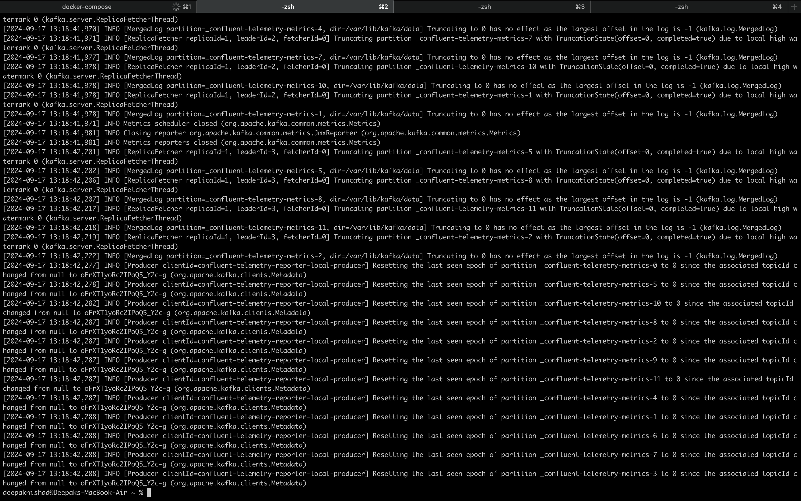
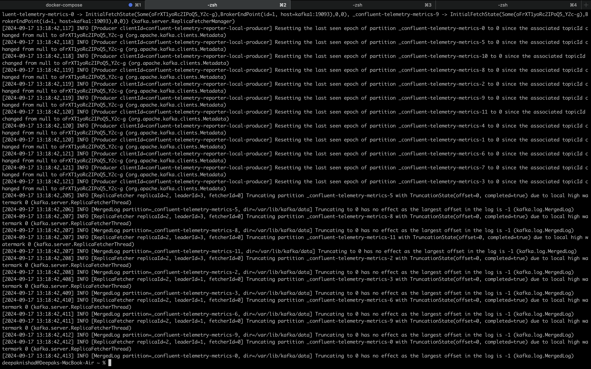
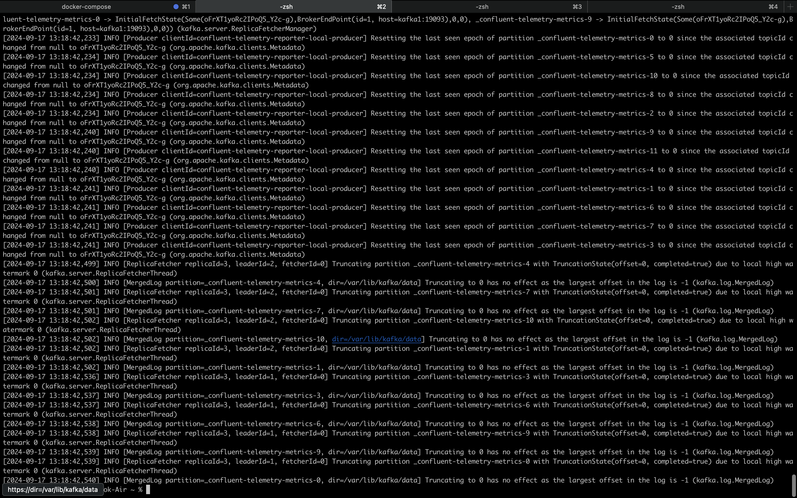

# Kafka SSL Setup Guide

This guide describes the steps to configure SSL for a Kafka cluster with three nodes. The process involves creating a Certificate Authority (CA), generating keystores and truststores, and signing certificates.


1. Create Your Own CA
Generate a new CA key and certificate:

```
openssl req -new -x509 -days 365 -keyout ca-key -out ca-cert -subj "/C=DE/ST=NRW/L=MS/O=juplo/OU=kafka/CN=Root-CA" -passout pass:kafka-broker;
```

2. Create Truststore and Import Root CA
Create a truststore for Kafka brokers and import the CA certificate into it:
```
keytool -keystore kafka.server.truststore.jks -storepass kafka-broker -import -alias ca-root -file ca-cert -noprompt
```
3. Create Keystore
Generate a new keystore and private key for a Kafka broker:
```
keytool -keystore kafka.server.keystore.jks -storepass kafka-broker -alias kafka1  -validity 365 -keyalg RSA  -genkeypair  -keypass kafka-broker -dname "CN=kafka1,OU=kafka,O=juplo,L=MS,ST=NRW,C=DE"
```

4. Create Certificate Signing Request (CSR)
Generate a CSR for the broker:
```
keytool -alias kafka1 -keystore kafka.server.keystore.jks -certreq -file cert-file -storepass kafka-broker -keypass kafka-broker
```

5. Sign the Certificate Using the CA
Sign the CSR with the CA certificate:
```
openssl x509 -req -CA ca-cert -CAkey ca-key -in cert-file -out cert-signed -days 365 -CAcreateserial -passin pass:kafka-broker -extensions SAN -extfile <(printf "\n[SAN]\nsubjectAltName=DNS:kafka1,DNS:localhost");
```

6. Import CA Certificate into Keystore
Import the CA certificate into the broker's keystore:
```
keytool -importcert -keystore kafka.server.keystore.jks -alias ca-root -file ca-cert -storepass kafka-broker -keypass kafka-broker -noprompt
```

7. Import Signed Certificate into Keystore
Import the signed certificate into the broker's keystore:
```
keytool -keystore kafka.server.keystore.jks -alias kafka1 -import -file cert-signed -storepass kafka-broker -keypass kafka-broker -noprompt
```
## Cluster Matrices


## Result
Kafka cluster is up and running



## Kafka1 logs



## Kafka2 logs



## Kafka3 logs

